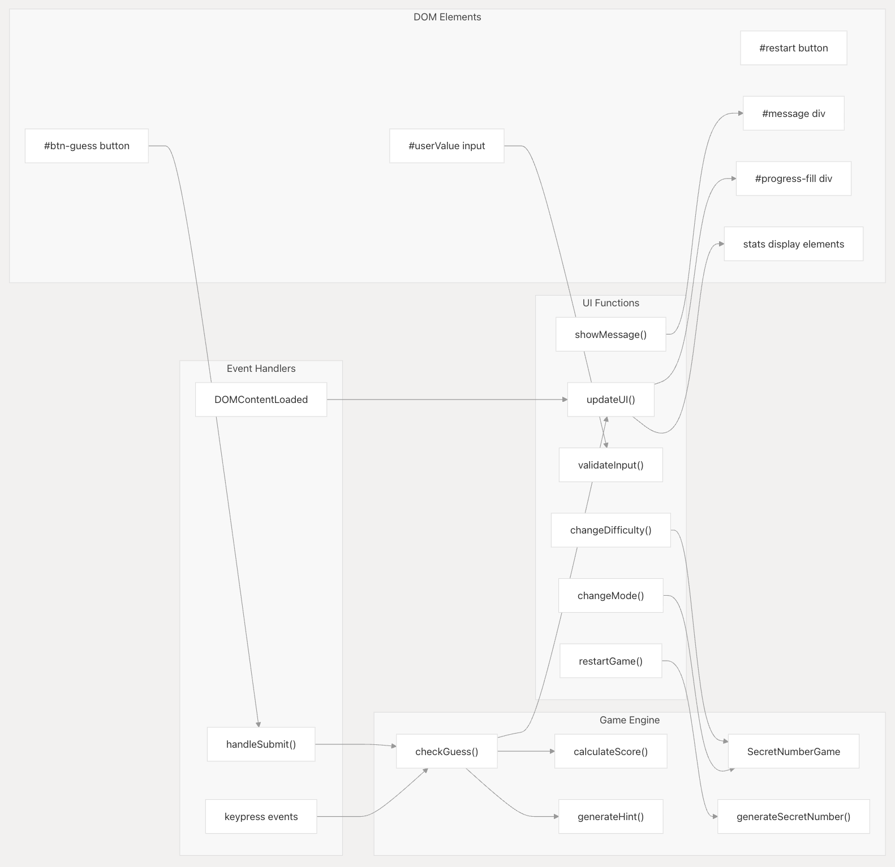

# 🎯 Secret Number Pro

[](https://secret-number-pro.vercel.app/)

An interactive game built with **HTML, CSS, and JavaScript**, where the goal is to guess a randomly generated secret number. The project features a modern UI, multiple difficulty levels, and different game modes to challenge your skills.

**[➡️ Try the Live Demo](https://secret-number-pro.vercel.app/)**

---

## ✨ Key Features

- **Modern & Responsive Design:** An attractive interface that adapts to any device (mobile, tablet, desktop).
- **Difficulty System:** Three levels to choose from (Easy: 1-10, Medium: 1-50, Hard: 1-100).
- **Game Modes:**
    - **Classic:** Unlimited attempts.
    - **Challenge:** Limited attempts for a greater challenge.
    - **Expert:** Very few attempts for true experts.
- **Dynamic Scoring:** Calculated based on difficulty, mode, and the number of attempts.
- **Progressive Hints:** The system provides hints based on how close you are to the secret number.
- **Statistics Tracking:** Persistently saves scores and game stats in your browser using `localStorage`.
- **Animations & Visual Effects:** Smooth transitions and "glassmorphism" effects for a superior user experience.

---

## 🛠️ Tech Stack

| Technology | Usage |
| :--- | :--- |
| **HTML5** | Semantic structure, forms, and accessibility. |
| **CSS3** | Visual system, animations, and responsive design. |
| **JavaScript (ES6)**| Game logic, DOM manipulation, and state management. |
| **Google Fonts** | Custom typography (Chakra Petch, Inter). |
| **localStorage** | Persistent storage for statistics. |

*This project was developed in **vanilla JavaScript**, with no external framework dependencies.*

---

## 🏗️ System Architecture

Secret Number Pro follows a three-layer client-side architecture with a clear separation of concerns and a "presentation-first" design philosophy, where the visual experience is a priority.


---

## 🔄 Component Interaction Flow

The following diagram illustrates how the DOM elements, event handlers, and game engine functions interact to bring the application to life.



---

## 🚀 How to Play and Run Locally

1.  **Clone the repository:**
    ```bash
    git clone [https://github.com/your-username/secret-number-pro.git](https://github.com/your-username/secret-number-pro.git)
    ```
2.  **Navigate to the project folder:**
    ```bash
    cd secret-number-pro
    ```
3.  **Open the `index.html` file in your preferred web browser.**
4.  Choose the difficulty and start playing!

---

## 📂 Project Structure

```
secret-number-pro/
├── README.md          # Project documentation
├── index.html         # Main structure (HTML)
├── style.css          # Visual styles (CSS)
├── app.js             # Game logic (JavaScript)
└── assets/            # Folder for images and other resources
    ├── System-Architecture-Diagram.png
    └── Component-Interaction-Diagram.png
```

---

## 📜 License
This project is free to use for learning, practice, and modification.
